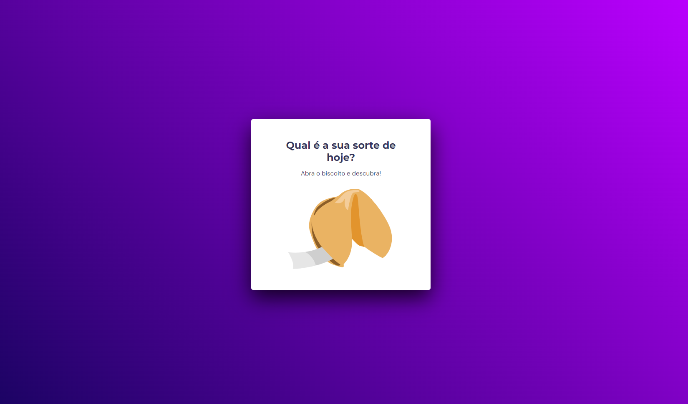
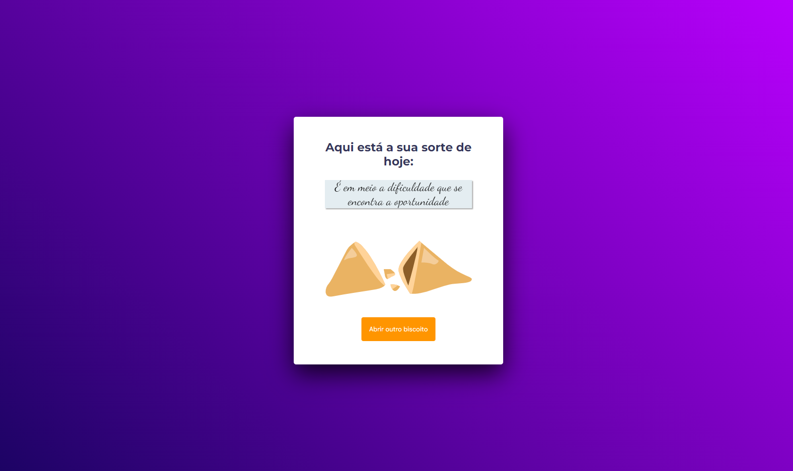

<strong><h1 align="center">Desafio 05 - Biscoito da Sorte</h1></strong>

## 💻 Projeto

Neste projeto o desafio foi criar um jogo chamado Biscoito da Sorte, no qual o usuário, a partir de um clique ou enter, abre um biscoito com a sua sorte do dia.

## 🎨 Layout

O layout do projeto está disponível no [Figma](https://www.figma.com/design/S68Zd9DzYj3yGZHNHhiOIQ/Biscoito-da-Sorte-(Community)?node-id=0-1&node-type=canvas&t=4avy1FtUuUPvqNLC-0)

  
  

## 🚀 Tecnologias

Esse projeto foi desenvolvido com as seguintes tecnologias:

- HTML e CSS
- JavaScript
- Git e Github
- Figma

## 🚀 Pré-requisitos

Antes de começar, você vai precisar ter instalado em sua máquina as seguinte ferramenta:

---

Feito com ♥ by [Gelzieny](https://gelzieny.dev)